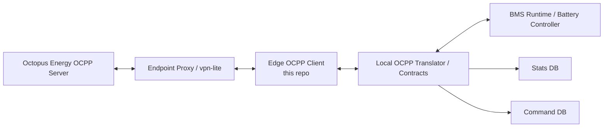
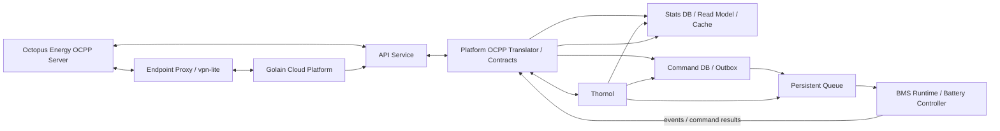
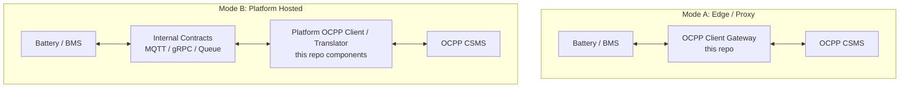
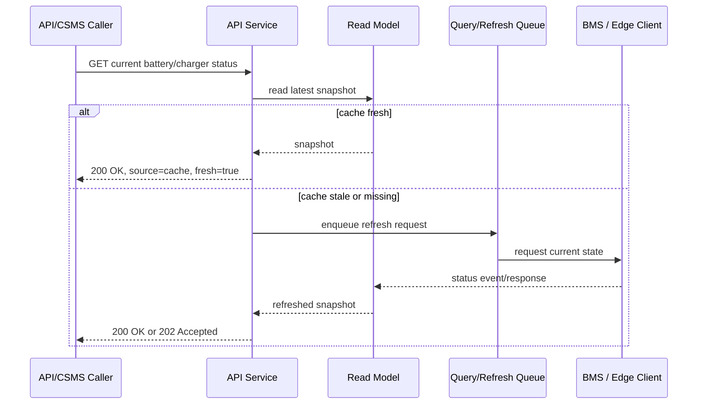
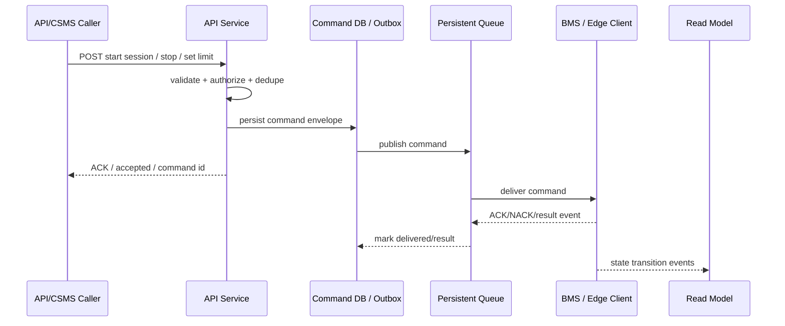
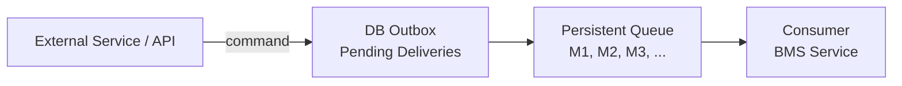

# Battery-Buffered Charger Architecture

## Summary

The target architecture supports two valid client deployment modes:

1. **Edge/proxy OCPP client**: the OCPP client runs close to the charger/BMS and
   talks directly to the battery. Our backend/proxy sits between this client and
   the external OCPP server, adding persistence, observability, cache/read-model
   behavior, and command tracking.
2. **Platform-hosted OCPP translator**: the OCPP client/translation layer runs
   in our platform. The battery/BMS talks to our platform using standard
   internal request/response/event contracts. The platform then behaves as the
   OCPP charge point client toward the external OCPP server.

Both modes are backend-mediated from the external system's point of view.
External systems, including an OCPP CSMS such as Octopus Energy, should not
depend on direct BMS APIs. They communicate with our edge/proxy or platform
boundary. That boundary owns protocol translation, command validation,
persistence, idempotency, retry behavior, read-cache freshness, and auditability.

The difference is where the OCPP translation boundary lives: on the edge near
the battery, or centrally in the platform.

## Target Data Flow

The reference architecture has two valid integration paths. We should support
both without changing the BMS domain model:

- **left path**: external OCPP server reaches an edge OCPP client through the
  endpoint proxy/vpn-lite service;
- **middle path**: external OCPP server reaches a platform API service, where
  OCPP translation and internal contracts are hosted centrally;
- **right path**: platform commands are persisted into an outbox/queue and then
  consumed by the BMS service.

### Mode A: Edge / Proxy OCPP Client

In this mode, the OCPP client sits close to the battery/BMS and can talk to the
battery directly through local contracts. The platform/proxy sits between the
client and the external OCPP server.



This mode is useful when:

- low-latency local battery control is required;
- the charger site needs to continue operating during cloud connectivity loss;
- the OCPP client is deployed per charger/site;
- local command persistence and replay are required at the edge.

### Mode B: Platform-Hosted OCPP Translator

In this mode, the OCPP client/translator sits in the platform. The battery/BMS
does not speak OCPP. It publishes events and consumes commands through internal
contracts. The platform translates those contracts into OCPP.



This mode is useful when:

- the platform should own all OCPP behavior centrally;
- batteries should expose only stable internal contracts;
- multiple CSMS integrations need to be supported without changing BMS code;
- command/query state should live primarily in cloud services.

## Placement Of This Client

This repository implements the OCPP client / charge point side. It can sit in
either deployment mode.



The client should remain platform-independent at the OCPP layer. SteVe is used
as a compatibility and live E2E test target, but the runtime target can be
Octopus or any other OCPP 1.6J-compliant CSMS.

## Command And Query Split

Both modes should follow a CQRS-style split:

- queries read from a read model/cache first;
- commands are validated and persisted before delivery;
- BMS events update the read model;
- command results are correlated back to the original command.

This does not require event sourcing initially. The important first step is to
separate the operational read path from the command delivery path.

### Query Path

GET requests should not always hit the battery.



Recommended behavior:

- return from cache when data is fresh enough;
- if stale and caller allows stale data, return cached response with
  `fresh=false` and trigger async refresh;
- if stale and caller requires fresh data, synchronously request BMS with a
  bounded timeout;
- if BMS is offline or slow, return `202 Accepted`, `503`, or stale data based
  on endpoint semantics.

In the reference architecture, this means `GET - give me current battery status`
is served by the API service from the Stats DB/read model when the cached value
is fresh. Only stale or missing data should trigger a BMS refresh through the
internal service/queue path.

### Command Path

POST/command requests should always go through the backend command path.



Commands should not be fire-and-forget from memory. The command must be durable
before the API acknowledges acceptance.

In Mode A, the durable command store may live on the edge, in the platform, or
both. In Mode B, the platform command DB/outbox is the primary command source of
truth.

In the reference architecture, this means `POST - Start charge session / Trx`
is translated into a standard command contract, written to Command DB / Outbox,
then delivered through the persistent queue to the BMS service.

The API response depends on the command type:

- **ACK command**: command requires a BMS status/result before the caller gets a
  final response.
- **UNACK command**: API can return `200 OK` or `202 Accepted` after durable
  persistence because the command does not require immediate BMS confirmation.

## What Is Implemented Now

### OCPP Protocol Layer

Implemented in `crates/ocpp-protocol`.

Current capabilities:

- typed OCPP 1.6J request/response structs;
- OCPP-J frame parsing and serialization;
- action registry for all OCPP 1.6J interactions;
- schema-level compatibility tests against bundled OCPP 1.6J JSON schemas;
- optional fields serialize as absent rather than JSON `null` where required by
  OCPP schemas.

### OCPP Transport Layer

Implemented in `crates/ocpp-transport`.

Current capabilities:

- WebSocket client session;
- `ocpp1.6` WebSocket subprotocol;
- outbound typed calls with correlation and timeout;
- inbound CSMS call dispatch through `CsmsHandler`;
- raw call path used by queue/replay-style flows.

### OCPP Adapter Layer

Implemented in `crates/ocpp-adapter`.

Current capabilities:

- translates internal device/charge-point state into OCPP behavior;
- handles CSMS-initiated OCPP commands;
- contains transaction, connectivity, metadata, and event handling logic.

This layer is the natural place for the OCPP translator boundary.

In Mode A, it can translate between local BMS commands/events and OCPP at the
edge.

In Mode B, the same concepts should be exposed as platform contracts, with the
translator hosted centrally.

### Store Layer

Implemented in `crates/ocpp-store`.

Current capabilities:

- local state storage;
- configuration/auth/reservation/profile stores;
- a queue module for pending OCPP calls.

This is a starting point for durable delivery, but it is not yet the full
backend command outbox described in the target architecture.

### Live Compatibility Tests

Implemented test/support files:

- `crates/ocpp-protocol/tests/ocpp_16j_schema_compat.rs`
- `crates/ocpp-transport/tests/steve_e2e.rs`
- `scripts/steve-e2e.sh`
- `Makefile`

Current verification:

- local protocol schema tests cover all OCPP 1.6J request/response schemas;
- live SteVe E2E spins up SteVe + MariaDB in Docker;
- the simulated client connects as `CP-0001`;
- CP-initiated and CSMS-initiated OCPP 1.6J interactions are exercised through
  real WebSocket and SteVe REST operation endpoints.

## What Is Not Implemented Yet

The following are required to match the full battery-buffered charger
architecture:

- API service exposing platform endpoints such as battery status and charge
  session commands;
- formal battery/BMS contracts;
- explicit decision per deployment whether the OCPP translator runs at the edge
  or in the platform;
- proxy contract between edge client and platform when Mode A is used;
- explicit CQRS read model with freshness policy;
- durable command outbox for BMS-bound commands;
- idempotency and deduplication keys on every command;
- command result correlation and reply routing;
- time-sensitive command replacement semantics;
- API-level command lifecycle model;
- clear ownership of cache invalidation and stale-read behavior;
- production security and authorization model around BMS commands;
- endpoint proxy/vpn-lite integration.

## Contracts To Define

The contracts differ slightly by mode.

In Mode A, define:

- edge client to BMS request/response contracts;
- edge client to platform/proxy telemetry contracts;
- local command persistence and replay contract;
- cloud-to-edge command contract if the platform can command the edge client.

In Mode B, define:

- BMS to platform event contracts;
- platform to BMS command contracts;
- platform read model contracts;
- platform OCPP mapping contracts.

The core payloads should remain the same where possible so both deployment modes
can share the same domain model.

### 1. Battery Status Snapshot

Purpose: read model object returned by GET status APIs and updated by BMS events.

Required fields:

- `batteryId`
- `chargerId`
- `connectorId`
- `observedAt`
- `source`
- `fresh`
- `socPercent`
- `state`
- `availableEnergyKwh`
- `maxChargePowerKw`
- `maxDischargePowerKw`
- `gridPowerKw`
- `batteryPowerKw`
- `evPowerKw`
- `faults`
- `warnings`
- `activeTransactionId`
- `activeSessionId`

Example:

```json
{
  "batteryId": "battery-1",
  "chargerId": "CP-0001",
  "connectorId": 1,
  "observedAt": "2026-04-28T06:00:00Z",
  "source": "cache",
  "fresh": true,
  "socPercent": 82,
  "state": "Available",
  "availableEnergyKwh": 45.2,
  "maxChargePowerKw": 120,
  "maxDischargePowerKw": 120,
  "gridPowerKw": 0,
  "batteryPowerKw": 0,
  "evPowerKw": 0,
  "faults": [],
  "warnings": [],
  "activeTransactionId": null,
  "activeSessionId": null
}
```

### 2. Cache Freshness Policy

Purpose: define whether a query can be answered from cache.

Required fields:

- `resourceType`
- `maxAgeMs`
- `serveStale`
- `refreshMode`
- `timeoutMs`

Suggested freshness defaults:

| Resource | Suggested TTL |
| --- | ---: |
| charger identity/config | 5-60 min |
| connector status | 5-30 sec |
| battery SoC | 5-15 sec |
| available power | 1-5 sec |
| active transaction state | 1-5 sec |
| faults | event-driven, plus periodic heartbeat |
| command result | command lifecycle based |

### 3. Command Envelope

Purpose: durable command wrapper used by API service, outbox, queue, and BMS.

Required fields:

- `commandId`
- `idempotencyKey`
- `dedupeKey`
- `commandType`
- `actorId`
- `targetId`
- `targetType`
- `correlationId`
- `replyTo`
- `createdAt`
- `notBefore`
- `expiresAt`
- `priority`
- `replacePolicy`
- `payload`

Example:

```json
{
  "commandId": "cmd_01H...",
  "idempotencyKey": "external-request-123",
  "dedupeKey": "charger:CP-0001:start-session:connector:1",
  "commandType": "StartChargeSession",
  "actorId": "octopus",
  "targetType": "charger",
  "targetId": "CP-0001",
  "correlationId": "corr_01H...",
  "replyTo": "commands.results",
  "createdAt": "2026-04-28T06:00:00Z",
  "notBefore": "2026-04-28T06:00:00Z",
  "expiresAt": "2026-04-28T06:05:00Z",
  "priority": 100,
  "replacePolicy": "replace_same_dedupe_key",
  "payload": {
    "connectorId": 1,
    "idTag": "E2E-TAG",
    "requestedPowerKw": 60
  }
}
```

### 4. Command Result

Purpose: standardized BMS response to a command.

Required fields:

- `commandId`
- `correlationId`
- `targetId`
- `status`
- `resultCode`
- `message`
- `observedAt`
- `payload`

Statuses:

- `ACKED`
- `NACKED`
- `IN_PROGRESS`
- `SUCCEEDED`
- `FAILED`
- `EXPIRED`
- `CANCELLED`

Example:

```json
{
  "commandId": "cmd_01H...",
  "correlationId": "corr_01H...",
  "targetId": "CP-0001",
  "status": "SUCCEEDED",
  "resultCode": "Started",
  "message": "Charge session started",
  "observedAt": "2026-04-28T06:00:02Z",
  "payload": {
    "sessionId": "sess_123",
    "transactionId": 42
  }
}
```

### 5. BMS Event Envelope

Purpose: event stream from BMS to backend/read model.

Required fields:

- `eventId`
- `eventType`
- `targetId`
- `connectorId`
- `occurredAt`
- `publishedAt`
- `sequence`
- `correlationId`
- `payload`

Important event types:

- `BatteryStatusObserved`
- `ConnectorStatusChanged`
- `CablePlugged`
- `CableUnplugged`
- `AuthorizationRequested`
- `SessionStarted`
- `MeterValueObserved`
- `SessionStopped`
- `FaultRaised`
- `FaultCleared`
- `CommandAccepted`
- `CommandRejected`
- `CommandCompleted`

### 6. OCPP Mapping Contract

Purpose: map internal BMS/platform events to OCPP messages.

Initial mappings:

| Internal Event / Command | OCPP Message |
| --- | --- |
| charger online | `BootNotification` |
| heartbeat tick | `Heartbeat` |
| connector state change | `StatusNotification` |
| auth requested | `Authorize` |
| session started | `StartTransaction` |
| meter sample | `MeterValues` |
| session stopped | `StopTransaction` |
| diagnostics progress | `DiagnosticsStatusNotification` |
| firmware progress | `FirmwareStatusNotification` |
| remote start command | `RemoteStartTransaction` |
| remote stop command | `RemoteStopTransaction` |
| reset command | `Reset` |
| availability command | `ChangeAvailability` |
| unlock command | `UnlockConnector` |
| charging profile command | `SetChargingProfile` |

## Queue And Outbox Design

The queue is the delivery mechanism between command persistence and command
execution. It should not be the source of truth by itself. The source of truth
for command lifecycle should be the command DB/outbox.

In Mode A, there can be two queues:

- cloud/platform queue for commands going to the edge client;
- local edge queue for commands going from the edge OCPP client to the BMS.

In Mode B, the primary queue is platform to BMS.

The reference queue shape is:



Each queued message must use a standard request/response contract:

- `correlationId`
- `idempotencyKey`
- `dedupeKey`
- `eventId`
- `actorId`
- `payload`
- `replyTo`

The queue must be persistent. If services restart, commands must not be lost.
This implies an outbox table or WAL-backed queue, plus retry and dead-letter
handling.

Recommended flow:

1. API receives command.
2. API validates permissions, target, payload, and idempotency key.
3. API writes command to command DB/outbox in `PENDING` state.
4. Queue publisher reads pending command and publishes to BMS queue.
5. BMS consumer receives command.
6. BMS sends ACK/NACK or result event.
7. Backend updates command state.
8. Backend updates read model if command changed charger state.
9. OCPP response behavior is derived from command lifecycle and OCPP timeout
   requirements.

### Queue Requirements

The queue must support:

- persistence across service restarts;
- at-least-once delivery;
- idempotent consumers;
- correlation id;
- reply-to topic/queue;
- command expiration;
- dead-letter queue;
- replacement of time-sensitive commands by dedupe key;
- visibility into pending/in-flight/failed commands.

### Time-Sensitive Replacement

Some commands should replace older pending commands. Example:

- `SetPowerLimit`
- `StartAtTime`
- `ContinueUntil`
- `SetChargingProfile`

If a new command with the same `dedupeKey` arrives before the old command is
delivered, mark the old command as `CANCELLED` or `SUPERSEDED` and deliver only
the latest command.

Commands that should generally not be replaced:

- `StartChargeSession`
- `StopChargeSession`
- `UnlockConnector`
- `Reset`

These should rely on idempotency keys and explicit lifecycle handling.

## API Endpoints To Add

Suggested first API surface:

```text
GET  /chargers/{chargerId}/status
GET  /chargers/{chargerId}/connectors/{connectorId}/status
GET  /batteries/{batteryId}/status
POST /chargers/{chargerId}/sessions
POST /chargers/{chargerId}/sessions/{sessionId}/stop
POST /chargers/{chargerId}/commands/reset
POST /chargers/{chargerId}/commands/unlock
POST /chargers/{chargerId}/commands/availability
POST /chargers/{chargerId}/commands/charging-profile
GET  /commands/{commandId}
GET  /commands?targetId={chargerId}
```

## Design Decisions

### External Systems Use Our Boundary

External systems talk to our platform/proxy/OCPP boundary. They do not depend on
direct BMS APIs.

Reason:

- isolates battery firmware/runtime from CSMS-specific behavior;
- gives one place for auth, dedupe, retry, audit, and observability;
- allows platform changes without battery changes.

### Cache First For Queries

GET requests read from cache first.

Reason:

- protects battery from high request volume;
- improves latency;
- keeps query availability independent of transient BMS delays;
- matches CQRS read-model practice.

### Durable Outbox For Commands

Commands are persisted before delivery.

Reason:

- avoids losing commands on service restart;
- supports retries and dead-lettering;
- gives audit trail;
- enables idempotency and replay.

### OCPP Translation Can Be Edge Or Platform

OCPP can terminate in an edge client or in the platform translator.

Reason:

- BMS should not need to understand OCPP;
- platform can support SteVe, Octopus, or other CSMS implementations;
- OCPP quirks stay contained.

The key design requirement is that BMS contracts stay stable even if OCPP/CSMS
behavior changes.

## Caveats

- OCPP 1.6J does not natively model every battery-buffered charger concept.
  Battery-specific state may need `DataTransfer` or platform APIs.
- Edge-hosted and platform-hosted translation have different failure modes.
  Edge mode is better for local autonomy; platform mode is better for centralized
  control and uniform contracts.
- If both modes are supported, contract compatibility becomes important. Avoid
  defining two incompatible BMS domain models.
- CSMS behavior varies. SteVe compatibility is strong evidence, not a guarantee
  that every CSMS accepts every optional profile or command exactly the same way.
- Fresh cache does not mean correct forever. The API must expose `observedAt`,
  freshness, and source metadata.
- At-least-once queues require idempotent BMS command handling.
- Synchronous OCPP command timeouts may be shorter than real BMS operation time.
  Some commands may need immediate ACK plus async completion events.
- Command replacement rules must be explicit per command type.
- Clock synchronization matters for reservations, charging profiles, command
  expiry, and cache freshness.
- Security profile handling for production OCPP connections must be configured
  per CSMS: plain, TLS/basic, or mTLS.

## Next Steps

1. Define the battery status, command envelope, command result, and BMS event
   schemas.
2. Decide which chargers use Mode A edge/proxy translation and which use Mode B
   platform-hosted translation.
3. Add a platform API service layer for status reads and charger commands.
4. Implement read model/cache tables with freshness metadata.
5. Implement command DB/outbox tables with lifecycle states.
6. Connect the outbox to the BMS or edge-client queue/transport.
7. Add idempotency and dedupe handling.
8. Add command result correlation and status APIs.
9. Map BMS events to OCPP actions in the adapter/translator.
10. Add E2E tests for cache hit, stale cache refresh, command retry, command
   dedupe, command replacement, and BMS offline behavior.
11. Extend live SteVe tests with platform API calls once the API service exists.
